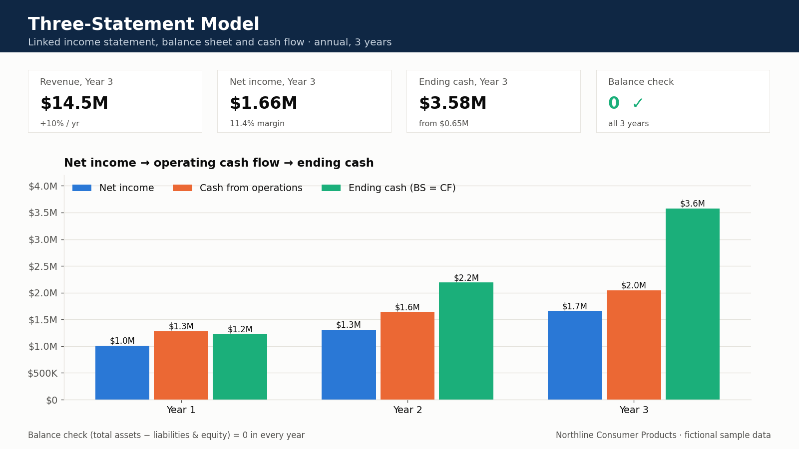

# Three-statement model

Linked annual statements for a fictional company (**Northline Consumer Products**).

**Open this file:** [`Northline_Three_Statement_Model.xlsx`](Northline_Three_Statement_Model.xlsx)

## Business question

If revenue, capex or working capital moves, do cash and the balance sheet still tie, or are these three separate spreadsheets wearing a costume?

## What you will see

| Tab | Role |
| --- | --- |
| `Assumptions` | Yellow inputs: revenue, COGS %, OpEx, D&A, interest, tax, capex, NWC build, debt, dividends, and the opening balance sheet |
| `IS` | Revenue → gross profit → EBIT → EBT → net income |
| `CF` | Indirect method: net income + D&A − NWC build = CFO; capex; debt and dividends; ending cash |
| `BS` | Cash (from CF), NWC, net PP&E, debt, equity, and a **balance check that stays at 0** |
| `Notes` | How the three statements link |

## How the links work

- Net income flows to the cash flow statement and to equity (less dividends).
- D&A is added back on the cash flow statement and reduces net PP&E; capex increases it.
- The NWC build is a use of cash and grows the NWC line.
- Debt issued or repaid hits both cash and the debt line.
- Ending cash on the cash flow statement **is** the cash line on the balance sheet.

## What to change in a screen-share

| Shock (on `Assumptions`) | Expected result |
| --- | --- |
| Raise Year 1 revenue | Net income and cash up; equity up by the same after-tax amount; check stays 0 |
| Raise capex in Year 2 | Cash down, net PP&E up by the same amount; check stays 0 |
| Increase the NWC build | CFO and cash fall even though net income is unchanged; check stays 0 |
| Pay a dividend | Cash and equity fall together; check stays 0 |

If the balance check moves off 0 after a shock, a link is broken and the model is not ready for a live case.

All numbers are made up. Excel formulas only: no VBA, no employer data.

[Profile](https://github.com/saisiri1207) · [Portfolio](https://saisiri1207.github.io) · [LinkedIn](https://www.linkedin.com/in/saisiri1207) · [bandarusaisiri1207@gmail.com](mailto:bandarusaisiri1207@gmail.com)
